# 数据标注系统介绍

V1.0

目录

[第一章 产品介绍 3](#产品介绍)

[一、 产品概述 3](#产品概述)

[二、 产品功能 3](#产品功能)

[1. 多角色 3](#多角色)

[2. 项目管理 3](#项目管理)

[3. 模板管理 3](#模板管理)

[4. 用户管理 4](#用户管理)

[5. 我的任务 4](#我的任务)

[6. 我的绩效 4](#我的绩效)

[三、 产品UI 4](#产品ui)

[第二章 技术介绍 5](#第二章-技术介绍)

[一．开发环境 5](#一开发环境)

[二．运行环境 5](#二运行环境)

[第三章 系统优势 6](#第三章-系统优势)

[一． 支持全类型 6](#支持全类型)

[二．拖拽式模板配置 6](#二拖拽式模板配置)

[三．作业流转 7](#三作业流转)

[第四章 图片类标注工具详细介绍 8](#第四章-图片类标注工具详细介绍)

[一、 图片类介绍 8](#图片类介绍)

[1. 图像类标注通用功能 8](#图像类标注通用功能)

[2. 矩形框标注 （矩形框标注用于物体识别和检测） 21](#矩形框标注-矩形框标注用于物体识别和检测)

[3. 多边形标注（多边形标注用于目标物体进行像素级分割标注，适用于实体分割、语义分割） 22](#多边形标注多边形标注用于目标物体进行像素级分割标注适用于实体分割语义分割)

[4. 描点标注（描点标注用于关键点标注。） 24](#描点标注描点标注用于关键点标注)

[5. 画线标注（画线标注用于线条识别。） 27](#画线标注画线标注用于线条识别)

[二．文本类标注工具组件 32](#二文本类标注工具组件)

[三．音频类标注工具组件 32](#三音频类标注工具组件)

[四．视频类标注工具组件 33](#四视频类标注工具组件)

[第五章 作业结果导出 34](#_Toc827427432)

# 产品介绍

## 产品概述 

数据标注系统是全类型一站式数据标注解决方案，即能够在一个系统内满足图像、语音、文本、视频、3D 点云等类型数据的清洗与标注。

数据标注系统实现了最佳的数据分发方案, 在技术上采用内存级队列服务实现百万级数据分发无差错的安全等级.

同时, 本系统数据标注工具提供简洁美观的界面、便捷的交互操作极大的提高了标注效率.

## **产品功能**

### 多角色

分为管理员和作业员两种角色。

管理员可以发布项目，管理项目，设置标注需求，和管理人员。

作业员只能标注和查看自己的绩效。

### **项目管理**

项目管理是核心模块之一。

该模块包括：发布项目，配置项目，复制项目，暂停项目，删除项目。

### **模板管理**

模板是解决如何标注的模块。

该模块有很多组件组成。包括：标签，表单，有序关键点等。

其中图片类，支持：矩形框，多边形，折现，三角形，四边形，曲线等

### **用户管理**

该模块可以创建新用户， 编辑用户，删除用户等操作。

### **我的任务**

该模块是作业员的功能模块。

作业员可以在该模块查看自己可以执行的任务列表。

并可以查看任务，执行作业，审核作业

### **我的绩效**

本模块展示作业员的工作统计。

## 产品UI

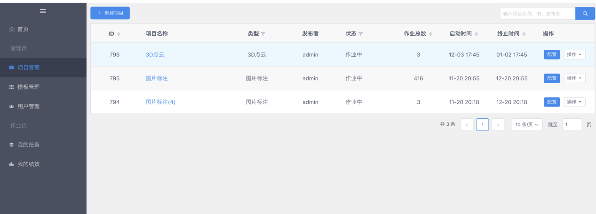

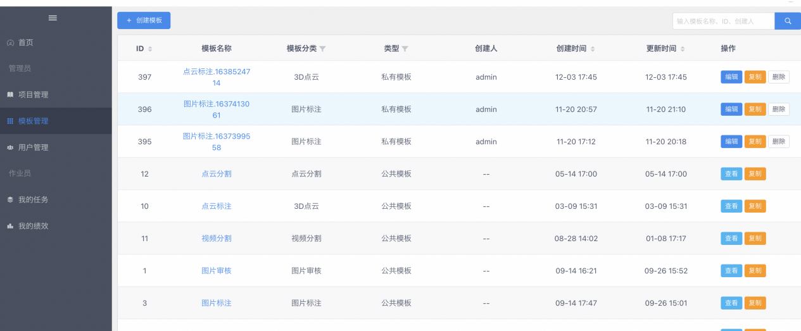

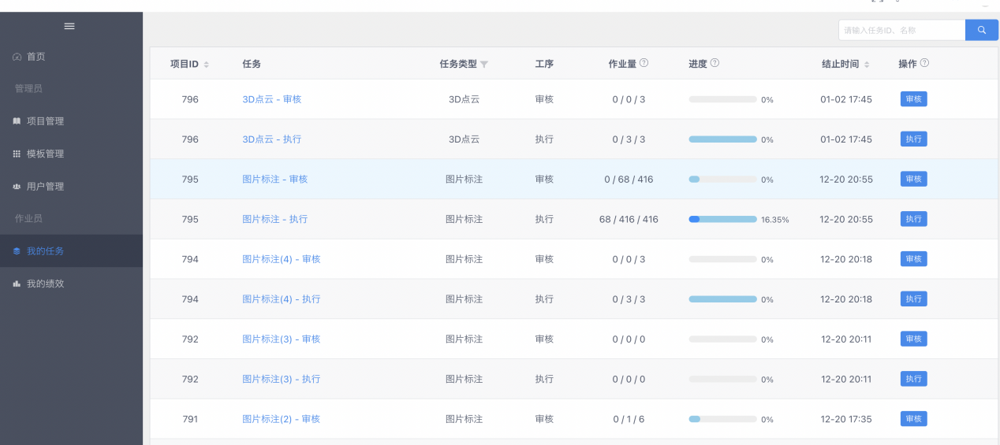

# 第二章 技术介绍

## 一．开发环境

开发语言：PHP，Javascript，Python

开发工具：Net Beans IDE

数据库：MySQL

应用框架：PHP框架 YII 2.0

代码规范：PSR-2，PHPDoc

## 二．运行环境

服务器要求

Centos 7.9 64位，CPU 4核，内存8G，硬盘 2T，带宽10M

# 第三章 系统优势

## **支持全类型**

本系统在设计之初就是要支持全部标注类型。

本系统在一个发布流程中支持图片，文本，语音，视频，3d点云。

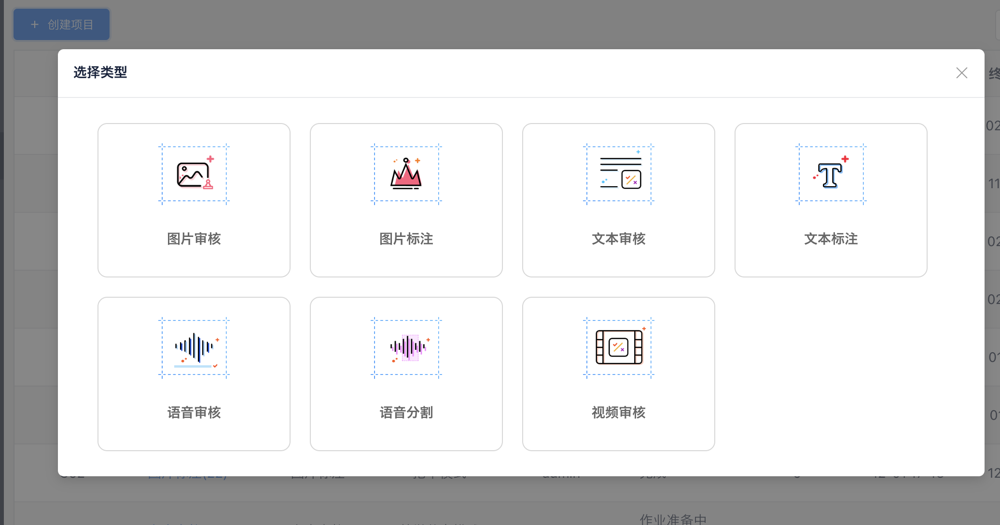

## 二．拖拽式模板配置

本系统的模板采用高可扩展的组件式设计。 在使用上采用拖拽式，对选中的组件进行拖拽，并智能生成标注界面。

支持组件：有序关键点，有序关键点租，图片展示，文本描述，布局，数据清洗，图片标注工具，标签，多行输入，单选框，多选框，下拉框，OCR等。

标签组件支持设置多级标签、标签颜色、限制标注大小、示例图片。

图片标注工具包括：线，圆，椭圆，折线，矩形，矩形+点，多边形，梯形，三角形，四边形，长方体，骨骼点，点，闭合曲线，曲线，钢笔线，矩形印章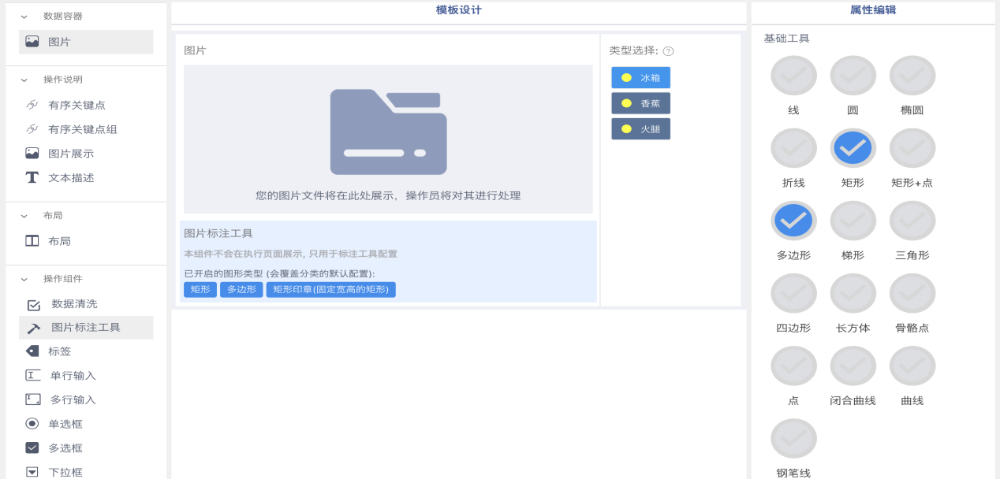

## 三．作业流转

本系统在作业过程中实现了工作流。支持数据在执行、审核、质检的工序中的作业流转，审核工序支持对标注工序提交结果的修改，从多方面保证作业流转效率。

支持提交、保存、挂起、退出、驳回、重置、管理员驳回、管理员重置等作业流转操作，应对作业实际生产中遇到的各种特殊情况。

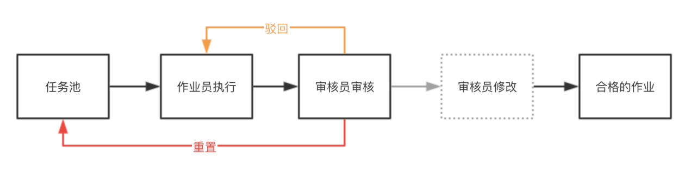

提交：将数据标注结果或审核结果提交到下一工序。

保存：将作业结果暂时保存下来，不进行提交，不影响标注。为防止出现停电、电脑死机等异常操作，但不能领取新的作业。

挂起：将作业结果保存在用户个人的作业池中，不进行提交，可以继续领取新的标注作业。为应对项目标注需求不清晰，需询问需求后，继续标注的场景，作业员在等待反馈时，不影响继续进行其他作业的操作。

退出：退出当前作业，作业结果不保存，不提交。

重置：将作业重置到上一步工序的作业池中，供所有标注员领取。

驳回：将作业驳回到上一步工序原作业员的作业池子中，供原标注员进行修改。

# 第四章 图片类标注工具详细介绍

## **图片类介绍**

### 图像类标注通用功能

#### 自定义标签（标签数量不限制且具备多层级定义）

本系统支持用户在模板配置时对标签进行自定义设置，并支持**Excel导入标签**。标签**数量不限制**，可添加多个标签，还可设置每个标签的**名称**、**颜色**，可设置**最大/小宽度和最大/长度**。标签页可分为**多层级标签**，即**设置标签组**，共分为三级标签组，在最后一级标签组下可无限制添加标签。

标注页面展示：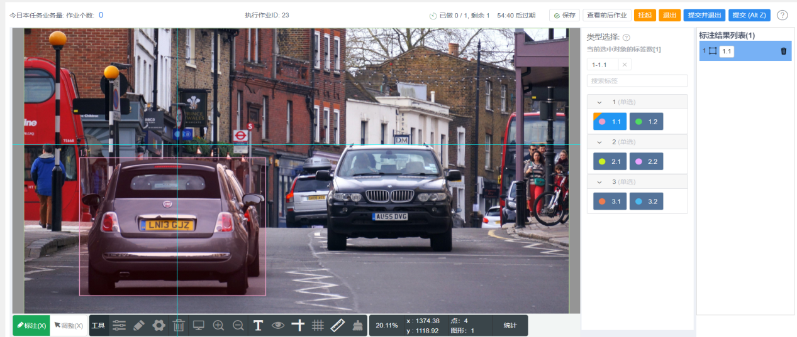

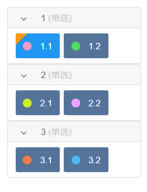

模板配置展示：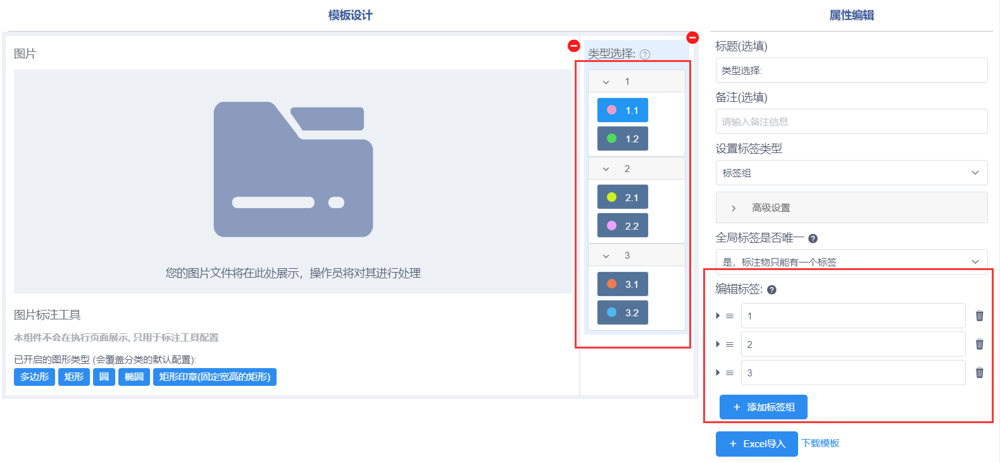

#### 调节亮度与对比度 

在图片标注页面，选择**调节按钮**，可以对图片**进行亮度和对比度的调节**，本系统同时支持**亮度正负调节和对比度正负调节**，点击**重置**按钮可**恢复默认**亮度与对比度。

调整后结果：

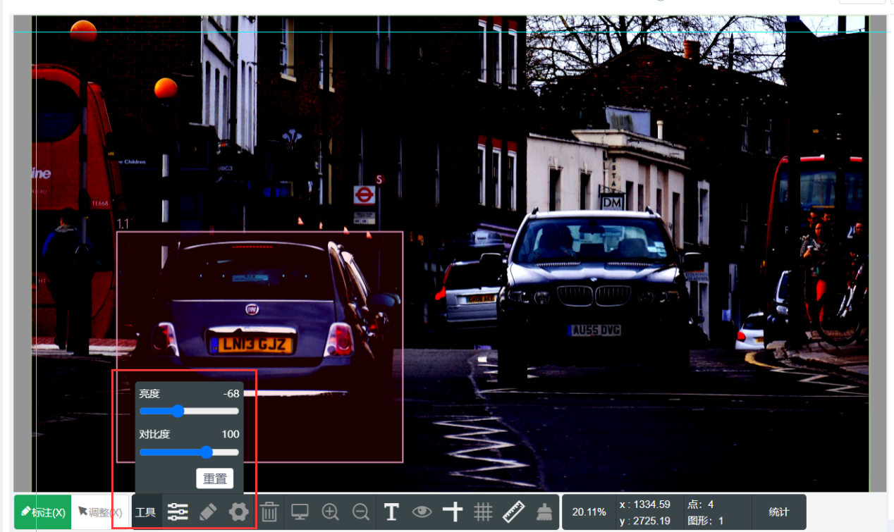

调整按钮：

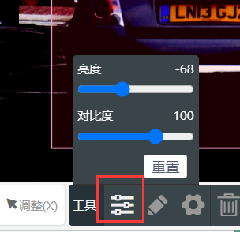

#### 放大/缩小图片 

在图片标注页面，将光标放置图片展示区，**滑动鼠标滚轮，可放大或缩小图片**。

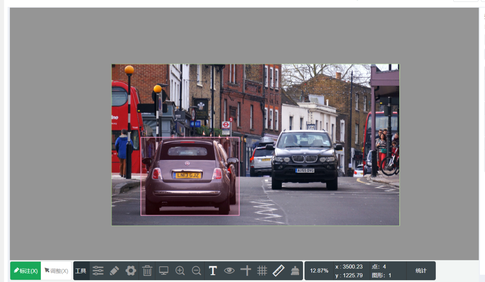

#### 设置等分线 

在图片标注页面，**选择设置等分线**，将**图片进行等分**。可选择**横向等分**、**纵向等分**。在如下位置设置等分线份数：

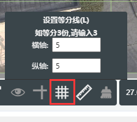

等分前：

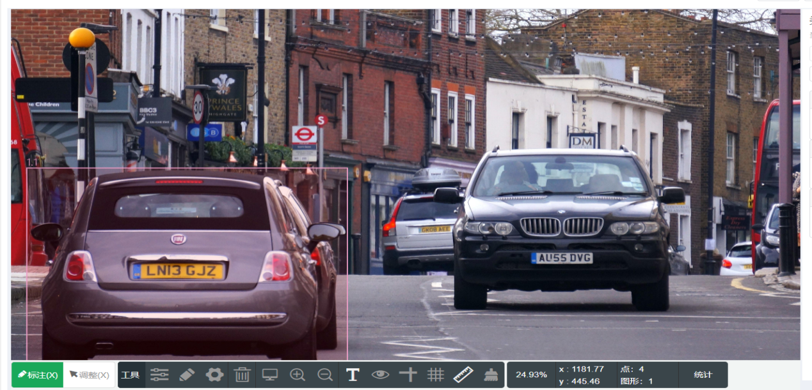

等分后：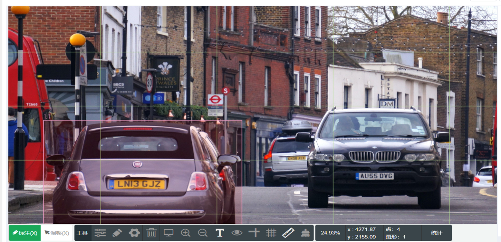

#### 显示/隐藏标注物体

在图片标注页面，点击**隐藏标注物体**按钮时，图片上的**标注结果**将会**被隐藏**。再**次点击**，则会**重新显示标注结果。**

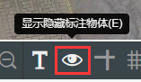

隐藏标注结果：

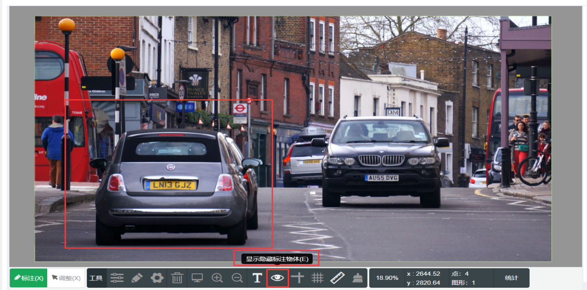

显示标注结果：

#### 鼠标调整/移动标注结果

在图片标注页面，进入调整模式，按住**Alt键**，同时用鼠标**拖动标注结果**，则可以**对标注结果进行移动**；**拖动**标注结果的各个**点**，则可 以**调整标注结果的大小**。

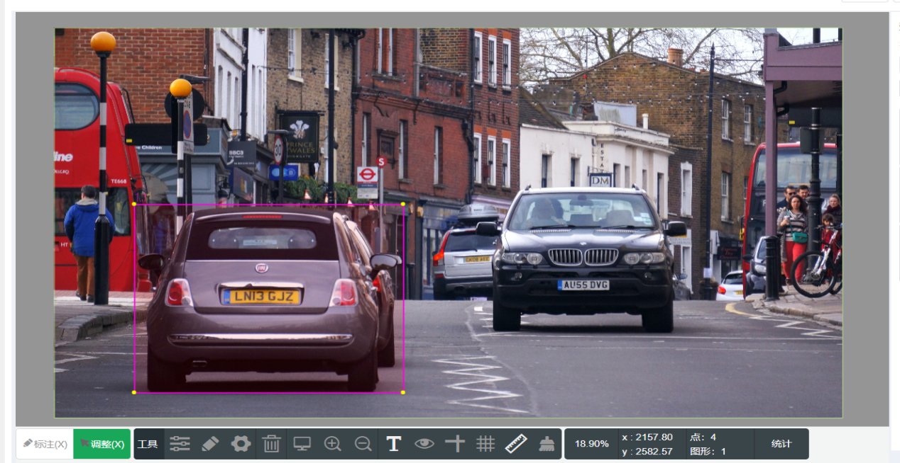

#### 是否显示标签

在图片标注页面，点击**隐藏标注文字**时，图片中标注结果上方的**标签将会被隐藏**。**再次点击**，则会重新**显示标注结果标签**。

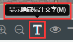

隐藏后：

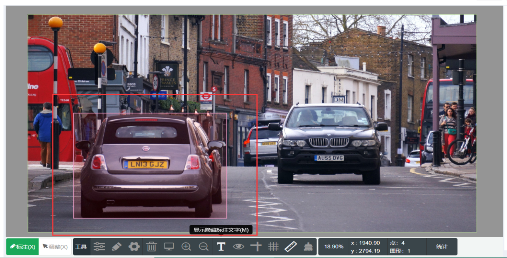

显示后：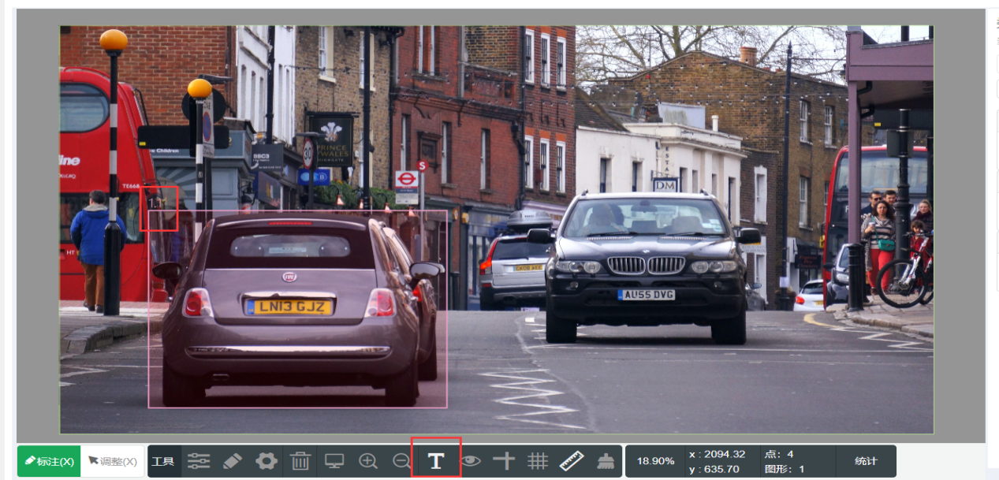

#### 显示/隐藏辅助线

在图片标注页面，点击**显示隐藏辅助线按钮**，会在图片标注区域显示以光标为交点的两条垂直直线，即为**显示标注辅助线**。辅助线可随光标的移动而移动。

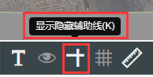

显示辅助线后：

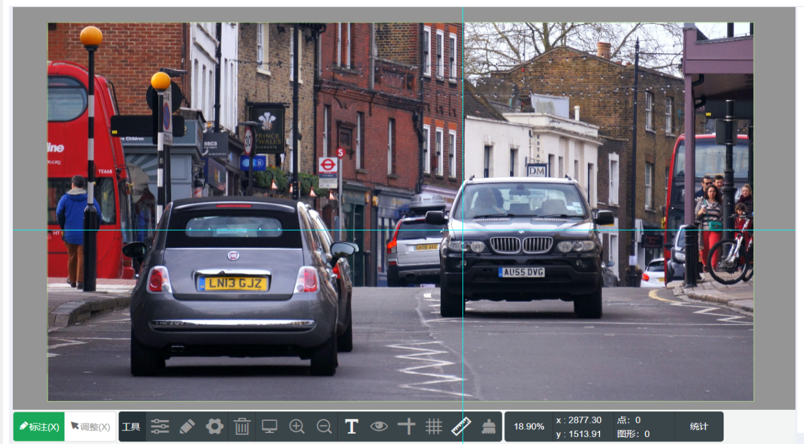

#### 导出数据时支持按类别输出图片 

在结果下载页面，选择好相应的批次、分步，以及导出数据所需的下载文件格式，本系统可支持多种文件下载格式，包括**json格式文件，TXT格式文件，mask图，xml格式文件，Pascalvoc格式文件等**，然后打包数据，则可以输出对应格式的结果文件，并支持**导出结果**下载。

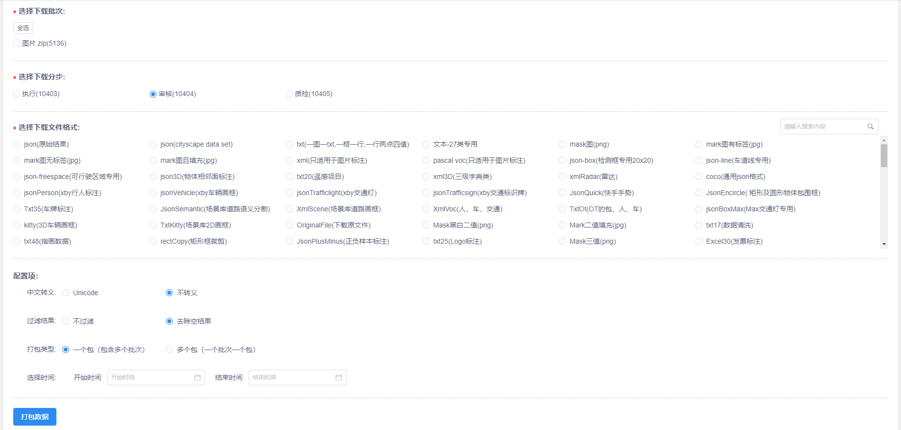

下图为**json格式的导出结果**：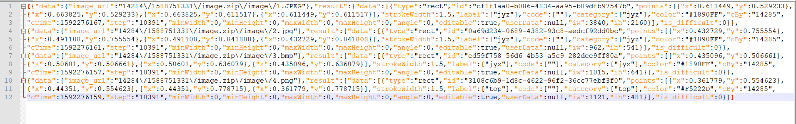

数据输出文件路径

在导出的json结果中，**文件路径**如下：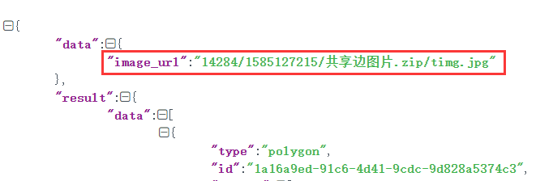

标签名称信息显示

以输出的图片标注**json结果**为例，在此处显示**标签名称信息**：

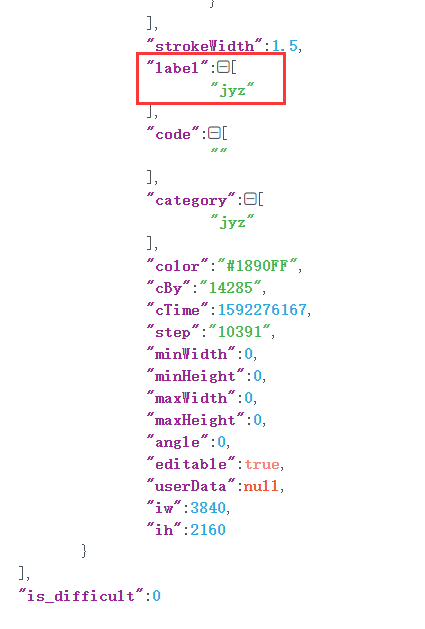

图像尺寸信息

以输出的图片标注**json结果**为例，在此处显示**图像的尺寸信息**：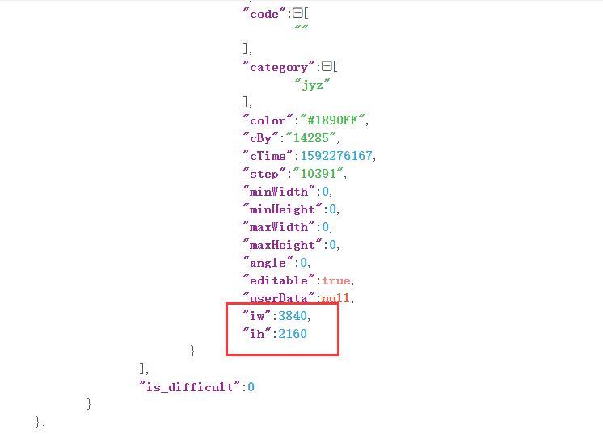

标注时间信息

以输出的图片标注**json结果**为例，在此处显示图像标注的**时间信息**：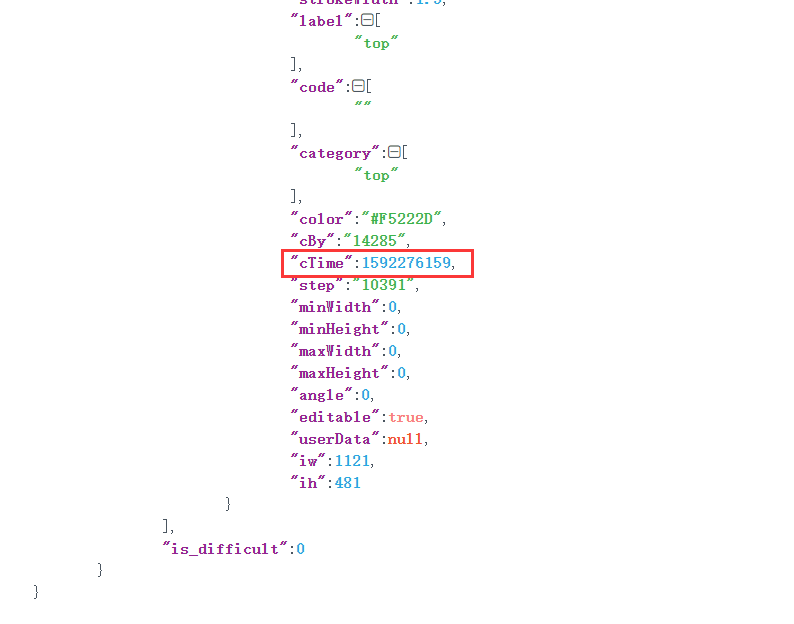

标注员ID信息

以输出的图片标注**json结果**为例，在此处显示**标注员的ID信息**：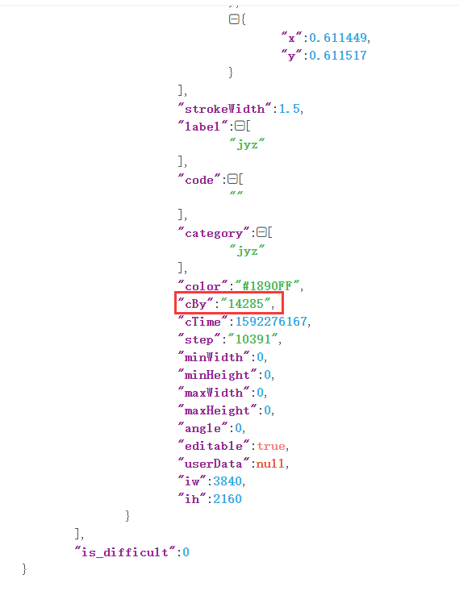

### 矩形框标注 （矩形框标注用于物体识别和检测）

#### 矩形框左上角和右下角的位置信息

在导出的**json结果**中，展示了矩形框的**各点的坐标信息**，**第一个坐标**信息和**第四个坐标**信息为**矩形框左上角和右下角的位置信息**。

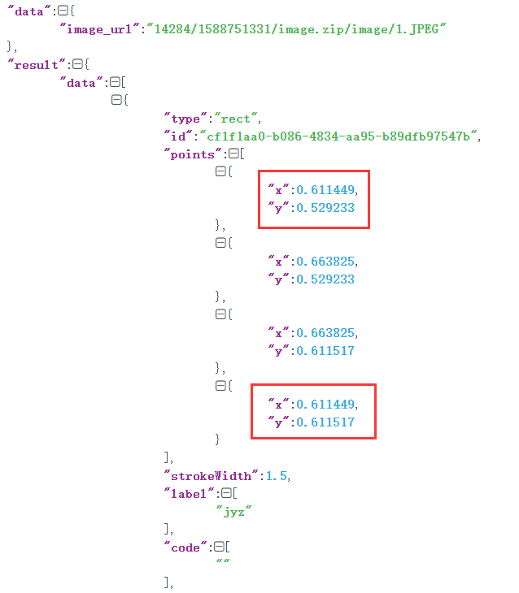

本系统标注工具将自定义标签，标签数量不限制且具备多层级定义，自定义标注颜色，调节亮度与对比度，放大/缩小图片，设置等分线，显示/隐藏标注物体，显示/隐藏辅助线，支持鼠标调整/移动矩形框，自动贴合,在线预览，是否显示标签、显示填充，数据输出文件路径、标签名称、图像尺寸、标注时间、标注员ID等信息，作为图像标注通用功能，在图像类标注工具组件开头统一讲解。

### 多边形标注（多边形标注用于目标物体进行像素级分割标注，适用于实体分割、语义分割）

#### 共享边标注

本系统支持在**多边形**进行语义分割时，进入共享边标注模式后，可对重叠的多个物体使用**共享边标注功能**。该标注方式**简单易用**，可**直观显示**共享边。

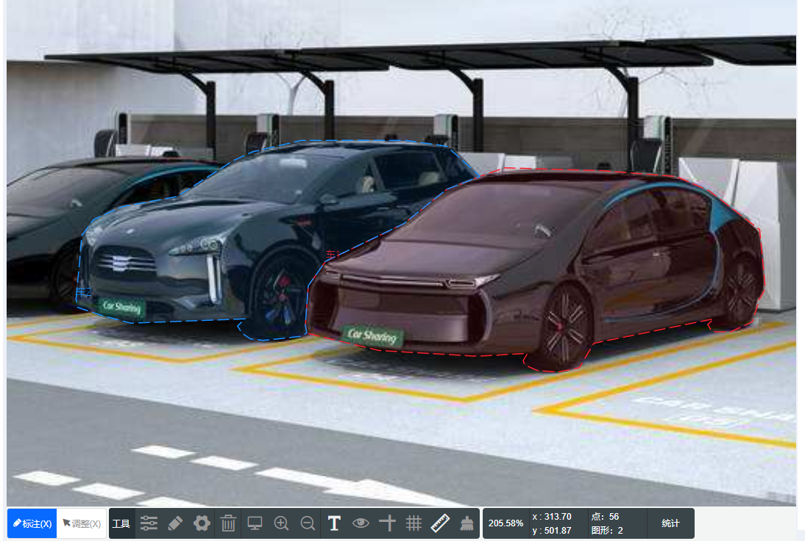

#### 多边形点坐标信息

在导出的**json结果**中，展示了多边形的**各点的坐标信息**。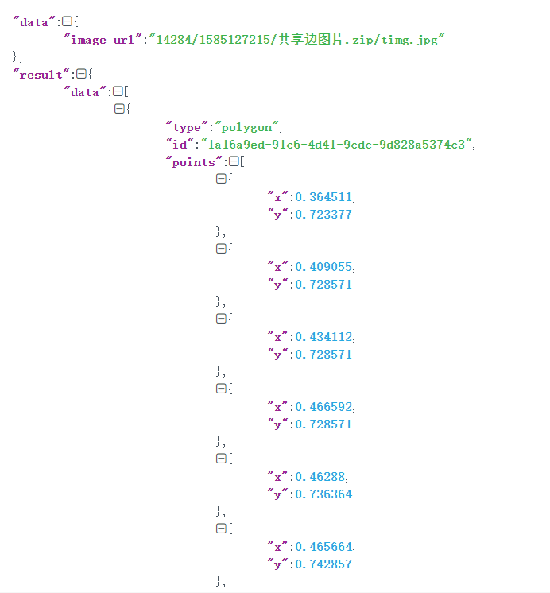

本系统标注工具将自定义标签，标签数量不限制且具备多层级定义，自定义标注颜色，调节亮度与对比度，放大/缩小图片，设置等分线，显示/隐藏标注物体，显示/隐藏辅助线，支持鼠标调整/移动多边形框，在线预览，是否显示标签、显示填充，数据输出文件路径、标签名称、图像尺寸、标注时间、标注员ID等信息，作为图像标注通用功能，在图像类标注工具组件开头统一讲解。

### 描点标注（描点标注用于关键点标注。）

#### 自由点标注

用户选择**"骨骼点"标注工具**后，根据右侧标注提示，可在图片标注区进行**自由点标注**。

标注结果展示：

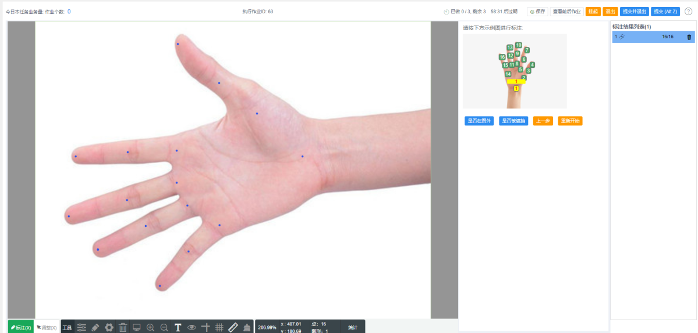

#### 关键点组标注

本系统支持用户进行**关键点组标注**，可将关键点**自定义分组**，支持添加**多个关键点组及关键点**，每个关键点组**独立显示**。

标注结果展示：

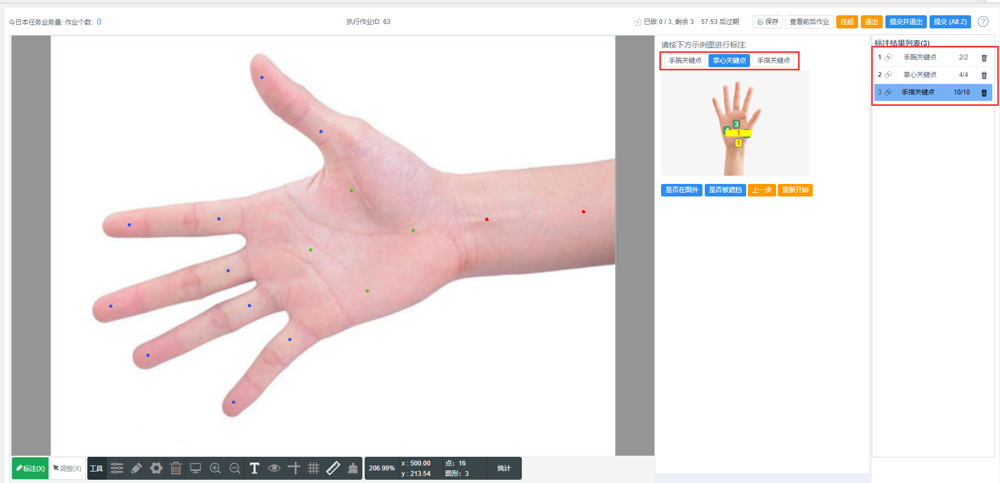

关键点组顺序定义，在线显示位置定位图，提前设定标注顺序

本系统支持**用户自定义**关键点组的**关键点顺序**，以及自行上传并编辑关键点位置定位图。在模板配置页面，可选择**更换示例图**，并**编辑示例图中点的位置**，**对关键点的顺序进行调整**，用户标注时需**根据顺序提示进行关键点组标注**。

标注结果展示：

模板配置页展示：

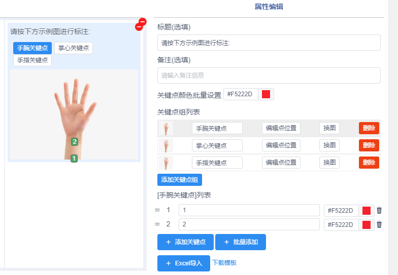

#### 关键点的位置信息

在导出的**json结果**中，展示了关键点组的**各点的坐标信息**。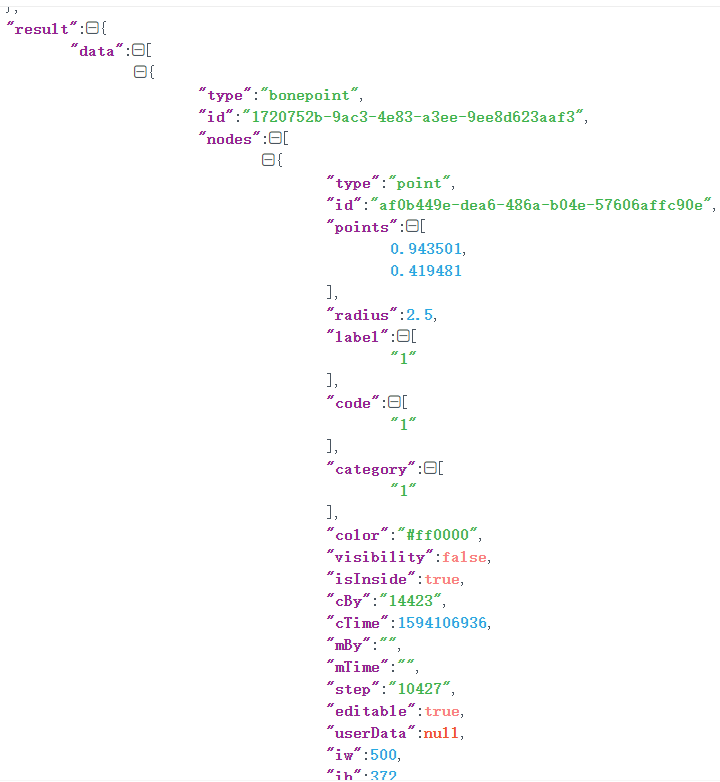

本系统标注工具将自定义标签，标签数量不限制且具备多层级定义，自定义标注颜色，调节亮度与对比度，放大/缩小图片，设置等分线，显示/隐藏标注物体，显示/隐藏辅助线，支持鼠标调整/移动关键点，在线预览，是否显示标签、显示填充，数据输出文件路径、标签名称、图像尺寸、标注时间、标注员ID等信息，作为图像标注通用功能，在图像类标注工具组件开头统一讲解。

### 画线标注（画线标注用于线条识别。）

#### 画线类标注工具

本系统支持**直线、折线、曲线、闭合曲线、钢笔线**工具用于画线标注，可灵活运用于多个场景标注。

标注结果展示：

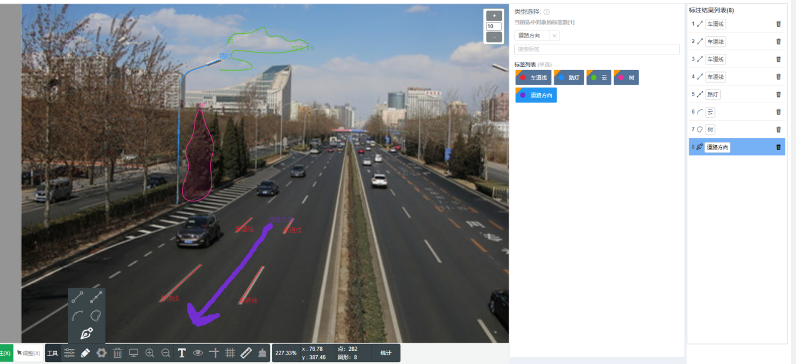

#### 设置画笔粗细及颜色

点击标注页面下方的**设置按钮**，可**对画笔粗细和颜色进行设置**。共三种粗细程度及三种颜色支持选择。

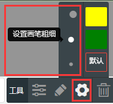 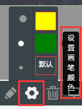

#### 不同线相接标注

本系统支持用户选择**多段线工具**进行**相接标注**。

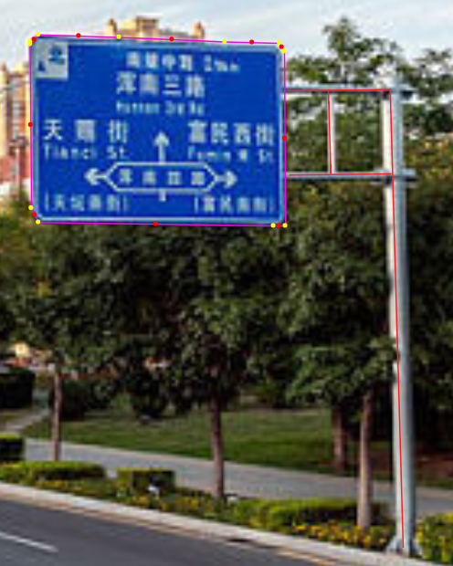

线端点的位置信息

在导出的**json结果**中，展示了各条线的**端点的坐标信息。**

直线：

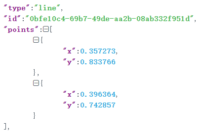

折线：

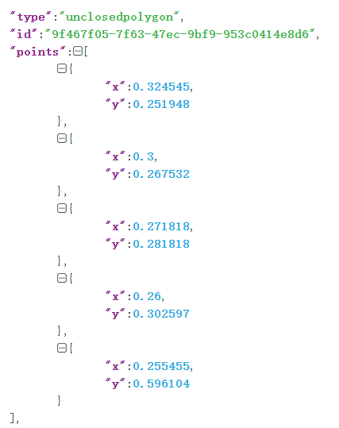

曲线：

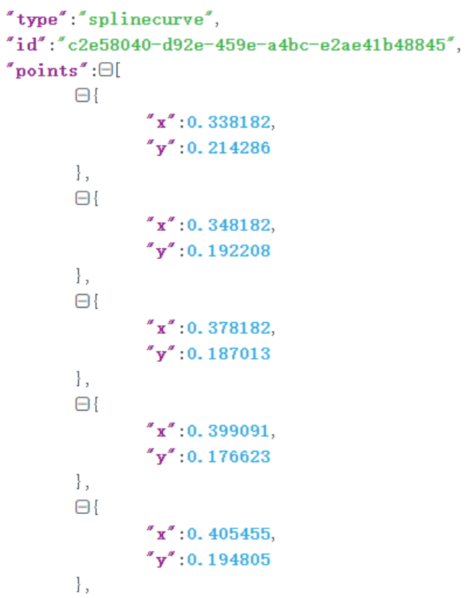

闭合曲线：

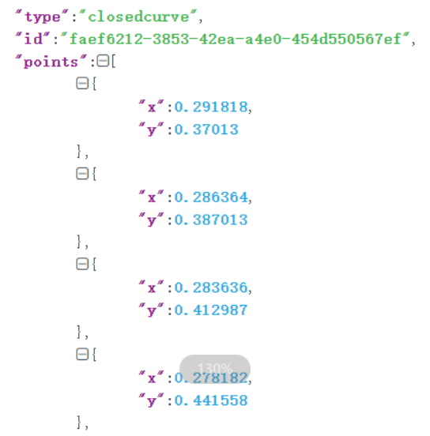

钢笔线：

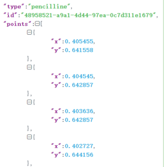

本系统标注工具将自定义标签，标签数量不限制且具备多层级定义，自定义标注颜色，调节亮度与对比度，放大/缩小图片，设置等分线，显示/隐藏标注物体，显示/隐藏辅助线，支持鼠标调整/移动线条，在线预览，是否显示标签、显示填充，数据输出文件路径、标签名称、图像尺寸、标注时间、标注员ID等信息，作为图像标注通用功能，在图像类标注工具组件开头统一讲解。

## 二．文本类标注工具组件

本系统拥有文本类标注工具，用户可根据需求选择该标注工具对文本进行相应的标注。文本类标注功能包括：关系标注、事件标注、文本分类聚类、词性标注、相似文本标注、关键词抽取、文本属性标注、依存句法标注、分词标注、文本翻译、文本审核。

标注页面展示：

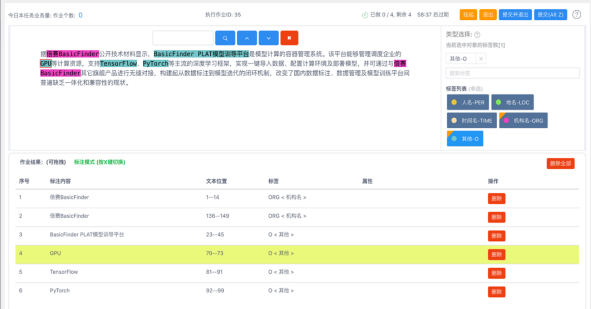

## 三．音频类标注工具组件

本系统拥有音频类标注工具，用户可根据需求选择该标注工具对音频进行相应的标注。用户上传目标音频后，音频在标注界面以波段的形式展示，用户可在波段上直接进行音频切割。切割后会在下方生成切割结果，用户可对每段切割结果进行转录描述，或对其进行属性标注。用户可在波段区播放/暂停整段音频，以及进行对应的播放设置和显示设置。在标注结果列表，用户也可以对切割的音频进行播放。

音频标注页面展示：

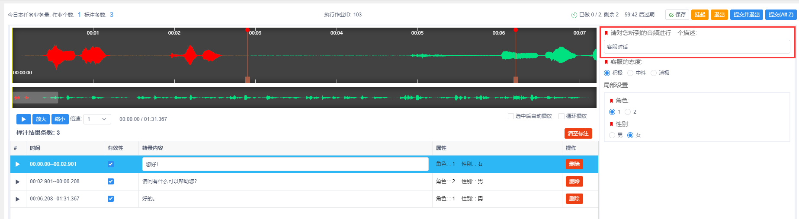

## 四．视频类标注工具组件

本系统拥有视频类标注工具，用户可根据需求选择该标注工具对视频进行相应的标注。用户上传目标视频后，视频将会展示在标注页面，用户可根据需要对视频进行播放/暂停操作，以及快进、全屏等操作。标注员可新建视频切割结果，结果将在右侧标注结果列表展示，标注员也可对相应的标注结果片段进行播放。

视频标注页面展示：

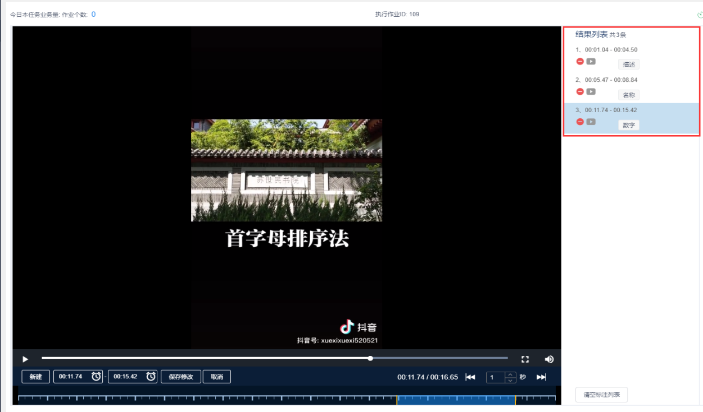

5.  []{#_Toc827427432 .anchor}**作业结果导出**

    本系统支持多种导出方式。

    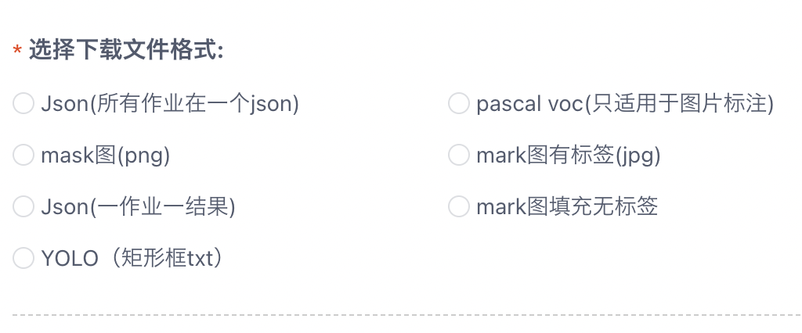

    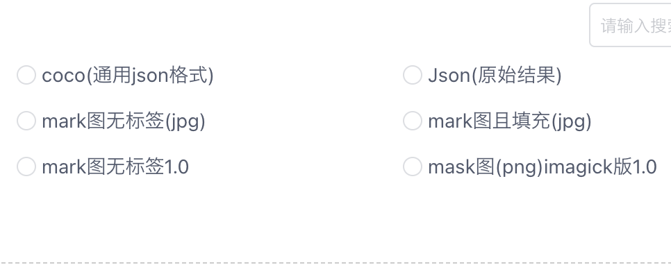
